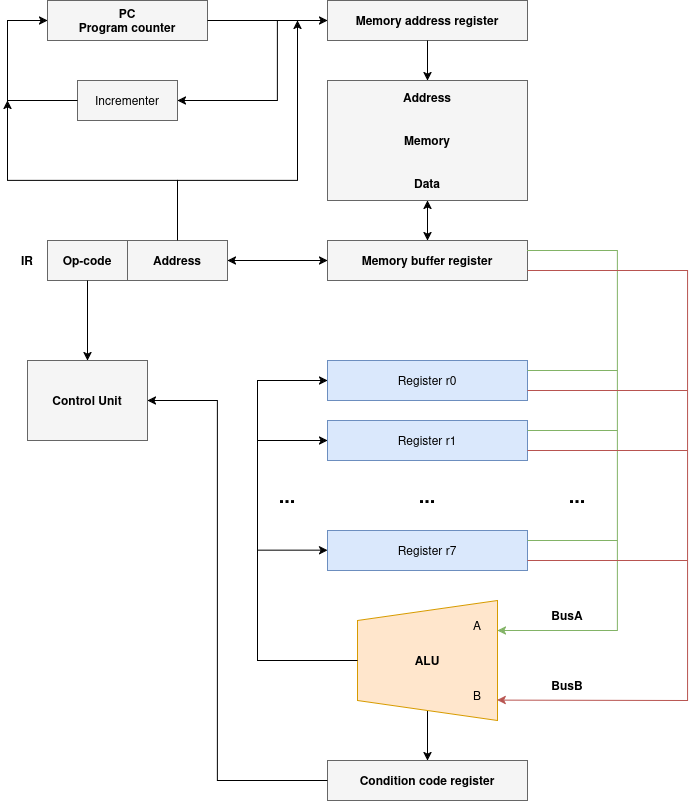
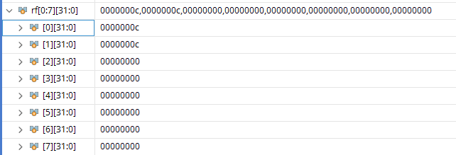

# Simple RISC CPU Implementation

This repository contains a hardware implementation of a **Simple RISC CPU** based on the **Von Neumann architecture**. The design focuses on a streamlined instruction set and clear architectural separation.

## 🏗 System Architecture

This is a implementation of a simple RISC CPU using Von Neumann architecture. The block diagram of the system is as follow:



[Image of Von Neumann architecture block diagram]


## Instruction Set Architecture (ISA)

The ISA is categorized into four main functional classes:

| Class | Group | Description |
| :--- | :--- | :--- |
| **00** | Special Operation | Functions such as `STOP` or `NOP`. |
| **01** | Data Transfer | Operations that copy data between registers and memory. |
| **10** | Data Processing | Arithmetic and logic functions (ALU operations). |
| **11** | Flow Control | Operations that control instruction sequencing (Branching). |

### Instruction Format (32-bit)
Fields used in the table below:
- `rrr`: Destination Register (`Rd`)
- `aaa`: Source Register 1 (`rS1`)
- `bbb`: Source Register 2 (`rS2`)
- `L`: Literal / Address offset

| Binary Code | Mnemonic | Instruction Format | Description |
| :--- | :--- | :--- | :--- |
| `00 00000` | **STOP** | `00 00000 000 000 000 0` | Terminate execution |
| `00 00001` | **NOP** | `00 00001 000 000 000 0` | No operation |
| `01 00000` | **MOV** | `01 00000 rrr aaa 000 0` | Load register from register |
| `01 00001` | **LDR** | `01 00001 rrr 000 000 L` | Load register from memory |
| `01 00010` | **STR** | `01 00010 000 aaa 000 L` | Store register in memory |
| `10 00000` | **ADD** | `10 00000 rrr aaa bbb 0` | Add: `Rd = rS1 + rS2` |
| `10 00001` | **ADDL** | `10 00001 rrr aaa 000 L` | Add Literal: `Rd = rS1 + L` |
| `10 00010` | **SUB** | `10 00010 rrr aaa bbb 0` | Subtract: `Rd = rS1 - rS2` |
| `10 00011` | **AND** | `10 00011 rrr aaa bbb 0` | Bitwise AND |
| `10 00100` | **OR** | `10 00100 rrr aaa bbb 0` | Bitwise OR |
| `10 00101` | **NOT** | `10 00101 rrr 000 000 0` | Bitwise NOT |
| `11 00000` | **CMP** | `11 00000 000 aaa bbb 0` | Compare registers |
| `11 00001` | **CMPL** | `11 00001 000 aaa 000 L` | Compare register with literal |
| `11 00010` | **BRA** | `11 00010 000 000 000 L` | Branch unconditionally |
| `11 00011` | **BEQ** | `11 00011 000 000 000 L` | Branch if Equal (Zero flag) |
| `11 00100` | **BNE** | `11 00100 000 000 000 L` | Branch if Not Equal |

---

## Simulation & Testing

In simulation, I’ve already tested all the instructions, and I’ve initialized the following program in the memory to check for running a complete program:

```assembly
; Program to test loops and arithmetic
LDR  r1, 16      ; Load constant from memory address 16
MOV  r0, r1      ; Copy r1 to r0

LOOP1:
    ADD  r0, r0, r1  ; r0 = r0 + r1
    ADDL r0, r0, 3   ; r0 = r0 + 3
    CMPL r0, 12      ; Compare r0 with 12
    BNE  LOOP1       ; If not equal, loop back to LOOP1

LOOP2:
    ADDL r1, r1, 2   ; r1 = r1 + 2
    CMP  r1, r0      ; Compare r1 with r0
    BNE  LOOP2       ; If not equal, loop back to LOOP2

STOP             ; End of program
```

